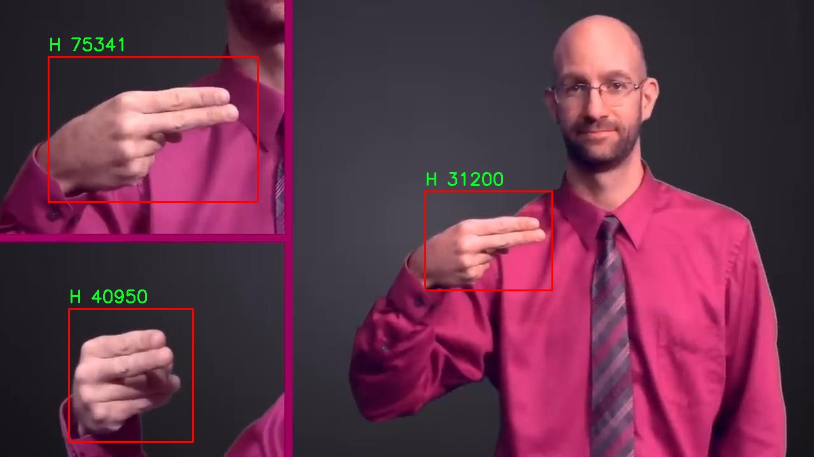

# 手语识别检测系统源码分享
 # [一条龙教学YOLOV8标注好的数据集一键训练_70+全套改进创新点发刊_Web前端展示]

### 1.研究背景与意义

项目参考[AAAI Association for the Advancement of Artificial Intelligence](https://gitee.com/qunshansj/projects)

项目来源[AACV Association for the Advancement of Computer Vision](https://gitee.com/qunmasj/projects)

研究背景与意义

随着信息技术的迅猛发展，手语作为一种重要的交流方式，逐渐受到社会各界的关注。手语不仅是聋哑人士与外界沟通的桥梁，也是促进他们融入社会的重要工具。尽管手语在全球范围内有着广泛的使用，但由于缺乏有效的识别和翻译工具，手语使用者在与听力正常者交流时常常面临障碍。因此，开发高效、准确的手语识别系统具有重要的现实意义。

近年来，深度学习技术的飞速发展为手语识别提供了新的机遇。尤其是YOLO（You Only Look Once）系列模型，以其高效的实时目标检测能力，成为计算机视觉领域的研究热点。YOLOv8作为该系列的最新版本，具备更强的特征提取能力和更快的推理速度，能够在复杂环境中实现高效的目标检测。基于YOLOv8的手语识别系统，不仅能够提高手语识别的准确性，还能在实时性上满足实际应用需求，从而为手语使用者提供更为便捷的交流方式。

本研究将基于改进的YOLOv8模型，构建一个手语识别系统，主要依托于ASL（American Sign Language）手语数据集。该数据集包含6091张图像，涵盖了27个类别，涵盖了从字母A到Z及手势“r”的多种手语表达。这一丰富的数据集为模型的训练和测试提供了坚实的基础，使得系统能够在多样化的手势识别任务中表现出色。

在手语识别的研究中，数据集的质量和多样性直接影响到模型的训练效果和最终的识别性能。ASL手语数据集的构建考虑到了手势的多样性和复杂性，为模型提供了充分的训练样本。这不仅有助于提高模型对不同手势的识别能力，也能增强其在不同环境和光照条件下的鲁棒性。通过对数据集的深入分析和挖掘，我们可以发现手语识别中存在的潜在问题，并针对性地进行改进，从而推动手语识别技术的发展。

此外，手语识别系统的应用场景非常广泛，包括教育、医疗、社交等多个领域。通过实现高效的手语识别，我们能够帮助聋哑人士更好地融入社会，提升他们的生活质量。同时，该系统也可以为听力正常者提供学习手语的工具，促进不同群体之间的理解与交流。因此，基于改进YOLOv8的手语识别系统不仅具有重要的学术价值，更具备深远的社会意义。

综上所述，基于改进YOLOv8的手语识别系统的研究，旨在通过深度学习技术提升手语识别的准确性和实时性，为聋哑人士提供更为便利的交流工具。这一研究不仅为手语识别领域提供了新的思路和方法，也为推动社会对手语的理解与包容贡献了一份力量。

### 2.图片演示


##### 注意：由于此博客编辑较早，上面“2.图片演示”和“3.视频演示”展示的系统图片或者视频可能为老版本，新版本在老版本的基础上升级如下：（实际效果以升级的新版本为准）

  （1）适配了YOLOV8的“目标检测”模型和“实例分割”模型，通过加载相应的权重（.pt）文件即可自适应加载模型。

  （2）支持“图片识别”、“视频识别”、“摄像头实时识别”三种识别模式。

  （3）支持“图片识别”、“视频识别”、“摄像头实时识别”三种识别结果保存导出，解决手动导出（容易卡顿出现爆内存）存在的问题，识别完自动保存结果并导出到tempDir中。

  （4）支持Web前端系统中的标题、背景图等自定义修改，后面提供修改教程。

  另外本项目提供训练的数据集和训练教程,暂不提供权重文件（best.pt）,需要您按照教程进行训练后实现图片演示和Web前端界面演示的效果。

### 3.视频演示

[3.1 视频演示](https://www.bilibili.com/video/BV1mT4YeaErA/)

### 4.数据集信息展示

##### 4.1 本项目数据集详细数据（类别数＆类别名）

nc: 26
names: ['A', 'B', 'C', 'D', 'E', 'F', 'G', 'H', 'I', 'J', 'K', 'L', 'M', 'N', 'O', 'P', 'Q', 'R', 'S', 'T', 'U', 'V', 'W', 'X', 'Y', 'Z']


##### 4.2 本项目数据集信息介绍

数据集信息展示

在手语识别领域，数据集的质量和多样性直接影响到模型的训练效果和识别准确率。本研究采用的“ASL Detection”数据集专门用于训练和改进YOLOv8手语识别系统，旨在提升对美国手语（ASL）的识别能力。该数据集包含26个类别，分别对应英文字母A至Z，涵盖了手语的基本构成元素。这一结构不仅为模型提供了丰富的训练样本，还确保了其在实际应用中的广泛适用性。

“ASL Detection”数据集的设计考虑到了手语的多样性和复杂性。每个字母的手势可能因个体差异、手部形状、动作速度等因素而有所不同，因此数据集中包含了多种不同风格和表现形式的手势图像。这种多样性使得模型在训练过程中能够学习到更为全面的特征，从而在实际应用中具备更强的泛化能力。数据集中的图像均经过精心标注，确保每个手势都能被准确识别，进而为YOLOv8模型的训练提供了坚实的基础。

在数据集的构建过程中，研究团队还特别关注了图像的清晰度和分辨率，以确保手势的细节能够被有效捕捉。高质量的图像不仅有助于提升模型的训练效率，还能在一定程度上减少后期识别过程中的误差。此外，数据集还包含了不同背景和光照条件下的手势图像，这样的设计使得模型能够适应多种环境，增强其在现实场景中的应用能力。

为进一步提升手语识别的准确性和鲁棒性，数据集还引入了数据增强技术。通过对原始图像进行旋转、缩放、裁剪等处理，研究团队生成了大量变体样本。这些增强样本不仅丰富了训练数据的多样性，还有效提高了模型对不同手势变化的适应能力。通过这种方式，YOLOv8能够在面对实际应用中可能遇到的各种情况时，依然保持较高的识别率。

在训练过程中，研究团队采用了分层抽样的方法，以确保每个类别的样本在训练集和验证集中的比例相对均衡。这种策略有助于避免模型在某些类别上过拟合，同时确保所有字母的手势都能得到充分的学习和识别。经过多轮的训练和验证，模型的性能得到了显著提升，能够在多种场景下实现实时的手语识别。

总之，“ASL Detection”数据集为改进YOLOv8手语识别系统提供了强有力的支持。通过丰富的类别设置、高质量的图像数据和有效的数据增强策略，该数据集不仅提升了模型的训练效果，也为手语识别技术的进一步发展奠定了坚实的基础。未来，随着数据集的不断扩展和优化，手语识别系统的应用场景将更加广泛，为聋哑人士的沟通和交流提供更为便利的解决方案。





### 5.全套项目环境部署视频教程（零基础手把手教学）

[5.1 环境部署教程链接（零基础手把手教学）](https://www.ixigua.com/7404473917358506534?logTag=c807d0cbc21c0ef59de5)


[5.2 安装Python虚拟环境创建和依赖库安装视频教程链接（零基础手把手教学）](https://www.ixigua.com/7404474678003106304?logTag=1f1041108cd1f708b01a)

### 6.手把手YOLOV8训练视频教程（零基础小白有手就能学会）

[6.1 手把手YOLOV8训练视频教程（零基础小白有手就能学会）](https://www.ixigua.com/7404477157818401292?logTag=d31a2dfd1983c9668658)

### 7.70+种全套YOLOV8创新点代码加载调参视频教程（一键加载写好的改进模型的配置文件）

[7.1 70+种全套YOLOV8创新点代码加载调参视频教程（一键加载写好的改进模型的配置文件）](https://www.ixigua.com/7404478314661806627?logTag=29066f8288e3f4eea3a4)

### 8.70+种全套YOLOV8创新点原理讲解（非科班也可以轻松写刊发刊，V10版本正在科研待更新）

由于篇幅限制，每个创新点的具体原理讲解就不一一展开，具体见下列网址中的创新点对应子项目的技术原理博客网址【Blog】：


[8.1 70+种全套YOLOV8创新点原理讲解链接](https://gitee.com/qunmasj/good)

### 9.系统功能展示（检测对象为举例，实际内容以本项目数据集为准）

图9.1.系统支持检测结果表格显示

  图9.2.系统支持置信度和IOU阈值手动调节

  图9.3.系统支持自定义加载权重文件best.pt(需要你通过步骤5中训练获得)

  图9.4.系统支持摄像头实时识别

  图9.5.系统支持图片识别

  图9.6.系统支持视频识别

  图9.7.系统支持识别结果文件自动保存

  图9.8.系统支持Excel导出检测结果数据


### 10.原始YOLOV8算法原理

原始YOLOv8算法原理

YOLOv8作为YOLO系列的最新版本，代表了目标检测领域的一次重要进步。其设计理念不仅继承了前几代模型的优点，还针对实际应用中的各种需求进行了深度优化。YOLOv8的架构由输入端、骨干网络、颈部网络和头部网络四个主要部分构成，每个部分都在不断提升模型的检测精度和速度方面发挥着重要作用。

在输入端，YOLOv8引入了马赛克数据增强技术，这一方法通过将多张图像拼接在一起，增加了训练数据的多样性，从而提升了模型的鲁棒性和泛化能力。然而，研究发现，过度使用马赛克数据增强可能会破坏数据的真实分布，导致模型学习到一些不良信息。因此，YOLOv8在训练的最后10个epoch中停止使用马赛克数据增强，以确保模型能够更好地适应真实场景。

骨干网络是YOLOv8的核心部分，其主要任务是提取输入图像的特征。YOLOv8将传统的C3模块替换为C2f模块，这一改进源于YOLOv7中的ELAN结构。C2f模块通过引入更多的跳层连接，增强了模型的梯度流，提升了特征表示能力。与此同时，YOLOv8保留了空间金字塔池化融合（SPPF）模块，以增强对多尺度特征的处理能力。SPPF通过三个最大池化层的组合，有效地提升了网络的特征抽象能力，确保模型能够捕捉到不同尺度的目标信息。

颈部网络则采用了路径聚合网络（PAN）结构，这一设计旨在加强不同缩放尺度对象的特征融合能力。PAN通过有效地传递特征信息，确保了骨干网络提取的特征能够被充分利用，从而提高了检测的准确性和效率。通过这种结构，YOLOv8能够更好地处理各种尺寸的目标，适应复杂的场景。

头部网络是YOLOv8的另一个重要创新点。与之前版本的耦合头不同，YOLOv8采用了解耦的检测头结构，将分类和回归任务分开处理。这一设计使得模型在进行目标检测时，能够更专注于各自的任务，提高了收敛速度和预测精度。分类任务侧重于分析特征图中的特征与已知类别的相似性，而定位任务则关注边界框与真实框之间的位置关系。这种侧重点的不同，使得解耦结构在实际应用中表现出更高的效率。

在损失计算方面，YOLOv8引入了任务对齐学习（Task Alignment Learning，TAL）策略，通过分类分数和交并比（IoU）的高次幂乘积来衡量任务对齐程度。这一策略使得模型在分类和定位损失函数中都能有效地引入任务对齐指标，从而实现更好的定位和分类性能。此外，YOLOv8还采用了无锚框检测头，直接预测目标的中心位置，减少了锚框预测的数量，从而加速了非最大抑制（NMS）过程，提高了检测速度。

在模型性能方面，YOLOv8在多个标准数据集上表现出色，尤其是在COCO数据集上，其mAP（mean Average Precision）指标显示出较高的准确性和较快的推理速度。通过对比不同尺寸的模型，YOLOv8在保持参数量相对稳定的情况下，显著提升了检测精度和速度。这使得YOLOv8在实时目标检测任务中，尤其是在资源受限的移动平台上，展现出极大的应用潜力。

综上所述，YOLOv8算法通过一系列创新设计和结构优化，成功地在目标检测领域实现了精度与速度的双重提升。其在输入端、骨干网络、颈部网络和头部网络的各个部分均进行了深入的改进，使得模型不仅能够高效地处理复杂场景中的目标检测任务，还能在实际应用中展现出良好的实时性和准确性。这些特性使得YOLOv8成为当前目标检测领域的重要工具，具有广泛的研究和应用价值。


### 11.项目核心源码讲解（再也不用担心看不懂代码逻辑）

#### 11.1 70+种YOLOv8算法改进源码大全和调试加载训练教程（非必要）\ultralytics\utils\callbacks\raytune.py

以下是对给定代码的核心部分进行提炼和详细注释的结果：

```python
# 导入必要的库和模块
from ultralytics.utils import SETTINGS

# 尝试导入Ray库和进行集成验证
try:
    # 确保设置中启用了Ray Tune集成
    assert SETTINGS['raytune'] is True  
    import ray
    from ray import tune
    from ray.air import session

# 如果导入失败或集成未启用，则将tune设置为None
except (ImportError, AssertionError):
    tune = None

# 定义在每个训练周期结束时调用的回调函数
def on_fit_epoch_end(trainer):
    """在每个训练周期结束时，将训练指标发送到Ray Tune。"""
    # 检查Ray Tune会话是否启用
    if ray.tune.is_session_enabled():
        # 获取当前训练器的指标
        metrics = trainer.metrics
        # 将当前周期数添加到指标中
        metrics['epoch'] = trainer.epoch
        # 向Ray Tune报告当前的训练指标
        session.report(metrics)

# 如果tune不为None，则定义回调字典，包含周期结束时的回调函数
callbacks = {
    'on_fit_epoch_end': on_fit_epoch_end, 
} if tune else {}
```

### 代码分析

1. **导入模块**:
   - 从`ultralytics.utils`导入`SETTINGS`，用于获取配置设置。
   - 尝试导入Ray库及其相关模块，以便进行分布式训练和超参数调优。

2. **集成验证**:
   - 使用`assert`语句检查`SETTINGS`中是否启用了Ray Tune。如果未启用或导入失败，则将`tune`设置为`None`，后续代码将不会使用Ray Tune的功能。

3. **回调函数**:
   - 定义了一个名为`on_fit_epoch_end`的函数，该函数在每个训练周期结束时被调用。
   - 在函数内部，首先检查Ray Tune会话是否启用。如果启用，则获取当前训练器的指标，并将当前周期数添加到指标中，最后通过`session.report(metrics)`将这些指标报告给Ray Tune。

4. **回调字典**:
   - 根据`tune`的值，决定是否将`on_fit_epoch_end`函数添加到回调字典中。如果`tune`为`None`，则回调字典为空，这意味着不会在训练过程中使用Ray Tune的功能。

### 总结
这段代码的核心功能是将训练过程中的指标通过Ray Tune进行报告，以便进行超参数调优和性能监控。

这个文件是一个与Ultralytics YOLO模型相关的回调函数实现，主要用于与Ray Tune集成，以便在训练过程中进行超参数调优。首先，文件引入了Ultralytics库中的设置（SETTINGS），并检查Ray Tune的集成是否被启用。如果没有启用，程序会捕获导入错误或断言错误，并将`tune`设置为`None`，这意味着如果Ray Tune不可用，相关的回调函数将不会被使用。

接下来，定义了一个名为`on_fit_epoch_end`的函数，这个函数在每个训练周期结束时被调用。它的作用是将训练的指标（metrics）发送到Ray Tune，以便进行监控和调优。在函数内部，首先检查Ray Tune的会话是否启用，如果启用，则从训练器（trainer）中获取当前的训练指标，并将当前的周期（epoch）信息添加到指标中。最后，通过`session.report(metrics)`将这些指标报告给Ray Tune。

最后，文件创建了一个名为`callbacks`的字典，其中包含了`on_fit_epoch_end`回调函数，如果`tune`不为`None`（即Ray Tune可用），则将该回调函数添加到字典中。这种设计使得在训练过程中可以灵活地集成Ray Tune进行超参数优化，同时也保证了在没有Ray Tune的情况下，程序依然可以正常运行。

#### 11.2 ui.py

以下是代码中最核心的部分，并附上详细的中文注释：

```python
import sys
import subprocess

def run_script(script_path):
    """
    使用当前 Python 环境运行指定的脚本。

    Args:
        script_path (str): 要运行的脚本路径

    Returns:
        None
    """
    # 获取当前 Python 解释器的路径
    python_path = sys.executable

    # 构建运行命令，使用 streamlit 运行指定的脚本
    command = f'"{python_path}" -m streamlit run "{script_path}"'

    # 执行命令
    result = subprocess.run(command, shell=True)
    # 检查命令执行的返回码，如果不为0则表示出错
    if result.returncode != 0:
        print("脚本运行出错。")

# 实例化并运行应用
if __name__ == "__main__":
    # 指定要运行的脚本路径
    script_path = "web.py"  # 这里可以替换为实际的脚本路径

    # 调用函数运行脚本
    run_script(script_path)
```

### 代码说明：
1. **导入模块**：
   - `sys`：用于访问与 Python 解释器相关的变量和函数。
   - `subprocess`：用于执行外部命令和程序。

2. **定义 `run_script` 函数**：
   - 该函数接收一个参数 `script_path`，表示要运行的 Python 脚本的路径。
   - 使用 `sys.executable` 获取当前 Python 解释器的路径，以确保使用正确的 Python 环境来运行脚本。
   - 构建一个命令字符串，使用 `streamlit` 模块运行指定的脚本。
   - 使用 `subprocess.run` 执行构建的命令，并检查返回码以判断脚本是否成功运行。

3. **主程序块**：
   - 在 `if __name__ == "__main__":` 中，确保只有在直接运行该脚本时才会执行以下代码。
   - 指定要运行的脚本路径（在这里是 `web.py`）。
   - 调用 `run_script` 函数来运行指定的脚本。

这个程序文件名为 `ui.py`，其主要功能是通过当前的 Python 环境运行一个指定的脚本。程序首先导入了必要的模块，包括 `sys`、`os` 和 `subprocess`，以及一个自定义模块 `QtFusion.path` 中的 `abs_path` 函数。

在程序中定义了一个名为 `run_script` 的函数，该函数接受一个参数 `script_path`，表示要运行的脚本的路径。函数内部首先获取当前 Python 解释器的路径，这通过 `sys.executable` 实现。接着，构建一个命令字符串，该命令使用 `streamlit` 模块来运行指定的脚本，格式为 `"{python_path}" -m streamlit run "{script_path}"`。

然后，使用 `subprocess.run` 方法执行构建好的命令，并通过 `shell=True` 选项允许在 shell 中执行命令。执行后，函数检查返回码，如果返回码不为零，表示脚本运行出错，则打印一条错误信息。

在文件的最后部分，使用 `if __name__ == "__main__":` 来判断当前模块是否为主程序。如果是，则指定要运行的脚本路径为 `web.py`，并调用 `run_script` 函数来执行这个脚本。脚本路径通过 `abs_path` 函数获取，确保路径是绝对路径。

总体来说，这个程序的主要作用是提供一个简单的接口来运行一个名为 `web.py` 的脚本，利用 `streamlit` 框架进行 web 应用的开发和展示。

#### 11.3 70+种YOLOv8算法改进源码大全和调试加载训练教程（非必要）\ultralytics\models\yolo\segment\__init__.py

```python
# 导入必要的模块
from .predict import SegmentationPredictor  # 导入分割预测器类
from .train import SegmentationTrainer      # 导入分割训练器类
from .val import SegmentationValidator      # 导入分割验证器类

# 定义模块的公开接口，指定可以被外部访问的类
__all__ = 'SegmentationPredictor', 'SegmentationTrainer', 'SegmentationValidator'
```

### 代码详细注释：

1. **导入模块**：
   - `from .predict import SegmentationPredictor`：从当前包的 `predict` 模块中导入 `SegmentationPredictor` 类，用于图像分割的预测功能。
   - `from .train import SegmentationTrainer`：从当前包的 `train` 模块中导入 `SegmentationTrainer` 类，用于训练分割模型。
   - `from .val import SegmentationValidator`：从当前包的 `val` 模块中导入 `SegmentationValidator` 类，用于验证分割模型的性能。

2. **定义公开接口**：
   - `__all__` 是一个特殊变量，用于定义模块的公共接口。这里将 `SegmentationPredictor`、`SegmentationTrainer` 和 `SegmentationValidator` 三个类列入其中，表示它们是模块对外提供的主要功能，外部代码可以通过 `from module_name import *` 语句访问这些类。

这个程序文件是一个Python模块的初始化文件，属于Ultralytics YOLO（You Only Look Once）系列的代码库，特别是与图像分割相关的部分。文件中首先声明了该项目遵循AGPL-3.0许可证，这意味着用户可以自由使用、修改和分发代码，但必须在相同许可证下共享衍生作品。

接下来，文件通过相对导入的方式引入了三个类：`SegmentationPredictor`、`SegmentationTrainer`和`SegmentationValidator`。这些类分别负责图像分割任务中的预测、训练和验证功能。具体来说，`SegmentationPredictor`可能用于对输入图像进行分割预测，`SegmentationTrainer`用于训练分割模型，而`SegmentationValidator`则用于验证模型的性能。

最后，`__all__`变量定义了模块的公共接口，列出了可以被外部导入的类。这意味着当其他模块使用`from .segment import *`时，只会导入这三个类，而不会导入模块中的其他内容。这种做法有助于封装和组织代码，使得模块的使用更加清晰和简洁。

#### 11.4 code\ultralytics\utils\tuner.py

以下是代码中最核心的部分，并附上详细的中文注释：

```python
import subprocess  # 用于执行系统命令

from ultralytics.cfg import TASK2DATA, TASK2METRIC, get_save_dir  # 导入配置相关的模块
from ultralytics.utils import DEFAULT_CFG, DEFAULT_CFG_DICT, LOGGER, NUM_THREADS  # 导入工具函数和常量

def run_ray_tune(
    model, space: dict = None, grace_period: int = 10, gpu_per_trial: int = None, max_samples: int = 10, **train_args
):
    """
    使用 Ray Tune 进行超参数调优。

    参数:
        model (YOLO): 要进行调优的模型。
        space (dict, optional): 超参数搜索空间。默认为 None。
        grace_period (int, optional): ASHA 调度器的宽限期（以 epochs 为单位）。默认为 10。
        gpu_per_trial (int, optional): 每个试验分配的 GPU 数量。默认为 None。
        max_samples (int, optional): 要运行的最大试验次数。默认为 10。
        train_args (dict, optional): 传递给 `train()` 方法的额外参数。默认为 {}。

    返回:
        (dict): 包含超参数搜索结果的字典。
    """

    # 日志记录 Ray Tune 的文档链接
    LOGGER.info("💡 Learn about RayTune at https://docs.ultralytics.com/integrations/ray-tune")
    
    # 如果没有提供 train_args，则初始化为空字典
    if train_args is None:
        train_args = {}

    # 尝试安装 Ray Tune
    try:
        subprocess.run("pip install ray[tune]".split(), check=True)

        import ray  # 导入 Ray 库
        from ray import tune  # 导入 Ray Tune
        from ray.air import RunConfig  # 导入运行配置
        from ray.air.integrations.wandb import WandbLoggerCallback  # 导入 Wandb 日志回调
        from ray.tune.schedulers import ASHAScheduler  # 导入 ASHA 调度器
    except ImportError:
        raise ModuleNotFoundError('调优超参数需要 Ray Tune。请使用: pip install "ray[tune]" 安装')

    # 尝试导入 Weights & Biases (wandb) 库
    try:
        import wandb
        assert hasattr(wandb, "__version__")  # 确保 wandb 已正确安装
    except (ImportError, AssertionError):
        wandb = False  # 如果未安装 wandb，则设置为 False

    # 定义默认的超参数搜索空间
    default_space = {
        "lr0": tune.uniform(1e-5, 1e-1),  # 初始学习率
        "lrf": tune.uniform(0.01, 1.0),  # 最终学习率的比例
        "momentum": tune.uniform(0.6, 0.98),  # 动量
        "weight_decay": tune.uniform(0.0, 0.001),  # 权重衰减
        "warmup_epochs": tune.uniform(0.0, 5.0),  # 预热 epochs
        "box": tune.uniform(0.02, 0.2),  # 边框损失增益
        "cls": tune.uniform(0.2, 4.0),  # 分类损失增益
        # 其他数据增强参数...
    }

    # 将模型放入 Ray 存储中
    task = model.task
    model_in_store = ray.put(model)

    def _tune(config):
        """
        使用指定的超参数和额外参数训练 YOLO 模型。

        参数:
            config (dict): 用于训练的超参数字典。

        返回:
            None.
        """
        model_to_train = ray.get(model_in_store)  # 从 Ray 存储中获取模型
        model_to_train.reset_callbacks()  # 重置回调
        config.update(train_args)  # 更新配置
        results = model_to_train.train(**config)  # 训练模型
        return results.results_dict  # 返回结果字典

    # 获取搜索空间
    if not space:
        space = default_space  # 如果没有提供搜索空间，则使用默认值
        LOGGER.warning("WARNING ⚠️ search space not provided, using default search space.")

    # 获取数据集
    data = train_args.get("data", TASK2DATA[task])  # 从 train_args 中获取数据集
    space["data"] = data  # 将数据集添加到搜索空间
    if "data" not in train_args:
        LOGGER.warning(f'WARNING ⚠️ data not provided, using default "data={data}".')

    # 定义可训练的函数并分配资源
    trainable_with_resources = tune.with_resources(_tune, {"cpu": NUM_THREADS, "gpu": gpu_per_trial or 0})

    # 定义 ASHA 调度器
    asha_scheduler = ASHAScheduler(
        time_attr="epoch",
        metric=TASK2METRIC[task],
        mode="max",
        max_t=train_args.get("epochs") or DEFAULT_CFG_DICT["epochs"] or 100,
        grace_period=grace_period,
        reduction_factor=3,
    )

    # 定义超参数搜索的回调
    tuner_callbacks = [WandbLoggerCallback(project="YOLOv8-tune")] if wandb else []

    # 创建 Ray Tune 超参数搜索调优器
    tune_dir = get_save_dir(DEFAULT_CFG, name="tune").resolve()  # 获取保存目录
    tune_dir.mkdir(parents=True, exist_ok=True)  # 创建目录
    tuner = tune.Tuner(
        trainable_with_resources,
        param_space=space,
        tune_config=tune.TuneConfig(scheduler=asha_scheduler, num_samples=max_samples),
        run_config=RunConfig(callbacks=tuner_callbacks, storage_path=tune_dir),
    )

    # 运行超参数搜索
    tuner.fit()

    # 返回超参数搜索的结果
    return tuner.get_results()
```

### 代码核心部分说明：
1. **导入模块**：导入必要的库和模块，包括 Ray Tune 和其他工具。
2. **定义超参数调优函数**：`run_ray_tune` 函数负责执行超参数调优的主要逻辑。
3. **安装依赖**：通过 `subprocess` 安装 Ray Tune。
4. **定义超参数搜索空间**：设定可调节的超参数范围。
5. **模型训练函数**：`_tune` 函数负责根据给定的超参数配置训练模型。
6. **创建调优器**：使用 Ray Tune 创建调优器并配置调度器和回调。
7. **执行调优**：调用 `tuner.fit()` 开始超参数搜索，并返回结果。

这个程序文件是用于超参数调优的，主要是通过Ray Tune库来实现对YOLO模型的超参数优化。首先，文件导入了一些必要的模块和库，包括用于配置的TASK2DATA、TASK2METRIC等，以及一些默认配置和日志记录工具。

在`run_ray_tune`函数中，用户可以传入模型、超参数搜索空间、训练过程中的一些参数等。函数的目的是通过Ray Tune来运行超参数调优，返回一个包含调优结果的字典。

函数首先记录了一条信息，指向Ray Tune的文档。接着，它会尝试安装Ray Tune库，如果未能导入，则抛出一个模块未找到的异常。随后，函数会检查是否安装了WandB（Weights and Biases）库，用于实验的可视化和记录。

接下来，定义了一个默认的超参数搜索空间，包括学习率、动量、权重衰减、数据增强等参数。这些参数的范围是通过`ray.tune`库中的不同分布函数来指定的。

函数内部还定义了一个`_tune`函数，用于训练模型并返回结果。在这个函数中，模型会从Ray的存储中获取，并根据传入的超参数和其他训练参数进行训练。

然后，函数会检查用户是否提供了搜索空间，如果没有，则使用默认的搜索空间，并发出警告。接着，获取数据集的信息，并将其添加到搜索空间中。

函数还定义了一个可训练的函数，并为其分配了计算资源（CPU和GPU）。接着，使用ASHAScheduler定义了超参数搜索的调度器，该调度器会根据训练过程中的性能指标来调整超参数的选择。

如果用户安装了WandB，函数会设置相应的回调函数，以便在调优过程中记录实验信息。然后，创建一个Ray Tune的调优器，并指定参数空间、调度器和回调函数等。

最后，调用`tuner.fit()`来执行超参数搜索，并返回调优结果。这个过程可以帮助用户找到最佳的超参数组合，从而提高YOLO模型的性能。

#### 11.5 70+种YOLOv8算法改进源码大全和调试加载训练教程（非必要）\ultralytics\trackers\utils\gmc.py

以下是代码中最核心的部分，并附上详细的中文注释：

```python
import cv2
import numpy as np

class GMC:
    """
    通用运动补偿 (GMC) 类，用于视频帧中的跟踪和物体检测。
    """

    def __init__(self, method='sparseOptFlow', downscale=2):
        """初始化 GMC 对象，指定跟踪方法和缩放因子。"""
        self.method = method  # 设置跟踪方法
        self.downscale = max(1, int(downscale))  # 设置缩放因子，确保至少为1

        # 根据选择的跟踪方法初始化检测器、提取器和匹配器
        if self.method == 'orb':
            self.detector = cv2.FastFeatureDetector_create(20)
            self.extractor = cv2.ORB_create()
            self.matcher = cv2.BFMatcher(cv2.NORM_HAMMING)
        elif self.method == 'sift':
            self.detector = cv2.SIFT_create(nOctaveLayers=3, contrastThreshold=0.02, edgeThreshold=20)
            self.extractor = cv2.SIFT_create(nOctaveLayers=3, contrastThreshold=0.02, edgeThreshold=20)
            self.matcher = cv2.BFMatcher(cv2.NORM_L2)
        elif self.method == 'ecc':
            self.warp_mode = cv2.MOTION_EUCLIDEAN  # 设置运动模型为欧几里得
            self.criteria = (cv2.TERM_CRITERIA_EPS | cv2.TERM_CRITERIA_COUNT, 5000, 1e-6)  # 迭代终止条件
        elif self.method == 'sparseOptFlow':
            self.feature_params = dict(maxCorners=1000, qualityLevel=0.01, minDistance=1, blockSize=3)
        elif self.method in ['none', 'None', None]:
            self.method = None
        else:
            raise ValueError(f'Error: Unknown GMC method:{method}')  # 抛出未知方法的错误

        # 初始化存储变量
        self.prevFrame = None  # 上一帧
        self.prevKeyPoints = None  # 上一帧的关键点
        self.prevDescriptors = None  # 上一帧的描述符
        self.initializedFirstFrame = False  # 标志位，指示是否处理了第一帧

    def apply(self, raw_frame, detections=None):
        """应用所选方法对原始帧进行物体检测。"""
        if self.method in ['orb', 'sift']:
            return self.applyFeatures(raw_frame, detections)  # 使用特征方法
        elif self.method == 'ecc':
            return self.applyEcc(raw_frame, detections)  # 使用ECC方法
        elif self.method == 'sparseOptFlow':
            return self.applySparseOptFlow(raw_frame, detections)  # 使用稀疏光流方法
        else:
            return np.eye(2, 3)  # 返回单位矩阵

    def applyEcc(self, raw_frame, detections=None):
        """应用ECC算法进行运动补偿。"""
        height, width, _ = raw_frame.shape  # 获取帧的高度和宽度
        frame = cv2.cvtColor(raw_frame, cv2.COLOR_BGR2GRAY)  # 将帧转换为灰度图
        H = np.eye(2, 3, dtype=np.float32)  # 初始化变换矩阵为单位矩阵

        # 如果需要，缩放图像
        if self.downscale > 1.0:
            frame = cv2.resize(frame, (width // self.downscale, height // self.downscale))

        # 处理第一帧
        if not self.initializedFirstFrame:
            self.prevFrame = frame.copy()  # 复制当前帧为上一帧
            self.initializedFirstFrame = True  # 标记为已初始化
            return H

        # 运行ECC算法，结果存储在H中
        try:
            (cc, H) = cv2.findTransformECC(self.prevFrame, frame, H, self.warp_mode, self.criteria, None, 1)
        except Exception as e:
            LOGGER.warning(f'WARNING: find transform failed. Set warp as identity {e}')  # 捕获异常并记录警告

        return H

    def applyFeatures(self, raw_frame, detections=None):
        """应用特征检测和匹配。"""
        height, width, _ = raw_frame.shape  # 获取帧的高度和宽度
        frame = cv2.cvtColor(raw_frame, cv2.COLOR_BGR2GRAY)  # 将帧转换为灰度图
        H = np.eye(2, 3)  # 初始化变换矩阵为单位矩阵

        # 如果需要，缩放图像
        if self.downscale > 1.0:
            frame = cv2.resize(frame, (width // self.downscale, height // self.downscale))

        # 查找关键点
        keypoints = self.detector.detect(frame, None)  # 检测关键点

        # 处理第一帧
        if not self.initializedFirstFrame:
            self.prevFrame = frame.copy()  # 复制当前帧为上一帧
            self.prevKeyPoints = copy.copy(keypoints)  # 复制当前关键点
            self.initializedFirstFrame = True  # 标记为已初始化
            return H

        # 匹配描述符
        knnMatches = self.matcher.knnMatch(self.prevDescriptors, descriptors, 2)  # KNN匹配

        # 过滤匹配
        matches = []
        for m, n in knnMatches:
            if m.distance < 0.9 * n.distance:  # 只保留较好的匹配
                matches.append(m)

        # 计算变换矩阵
        if len(matches) > 4:
            prevPoints = np.array([self.prevKeyPoints[m.queryIdx].pt for m in matches])
            currPoints = np.array([keypoints[m.trainIdx].pt for m in matches])
            H, inliers = cv2.estimateAffinePartial2D(prevPoints, currPoints, cv2.RANSAC)  # 估计变换矩阵

        # 存储当前帧和关键点以备下次使用
        self.prevFrame = frame.copy()
        self.prevKeyPoints = copy.copy(keypoints)

        return H

    def applySparseOptFlow(self, raw_frame, detections=None):
        """应用稀疏光流方法进行运动补偿。"""
        height, width, _ = raw_frame.shape  # 获取帧的高度和宽度
        frame = cv2.cvtColor(raw_frame, cv2.COLOR_BGR2GRAY)  # 将帧转换为灰度图
        H = np.eye(2, 3)  # 初始化变换矩阵为单位矩阵

        # 如果需要，缩放图像
        if self.downscale > 1.0:
            frame = cv2.resize(frame, (width // self.downscale, height // self.downscale))

        # 查找关键点
        keypoints = cv2.goodFeaturesToTrack(frame, mask=None, **self.feature_params)  # 查找良好的特征点

        # 处理第一帧
        if not self.initializedFirstFrame:
            self.prevFrame = frame.copy()  # 复制当前帧为上一帧
            self.prevKeyPoints = copy.copy(keypoints)  # 复制当前关键点
            self.initializedFirstFrame = True  # 标记为已初始化
            return H

        # 计算光流
        matchedKeypoints, status, err = cv2.calcOpticalFlowPyrLK(self.prevFrame, frame, self.prevKeyPoints, None)

        # 仅保留有效的匹配点
        prevPoints = []
        currPoints = []
        for i in range(len(status)):
            if status[i]:
                prevPoints.append(self.prevKeyPoints[i])
                currPoints.append(matchedKeypoints[i])

        # 计算变换矩阵
        if len(prevPoints) > 4:
            H, inliers = cv2.estimateAffinePartial2D(np.array(prevPoints), np.array(currPoints), cv2.RANSAC)

        # 存储当前帧和关键点以备下次使用
        self.prevFrame = frame.copy()
        self.prevKeyPoints = copy.copy(keypoints)

        return H
```

### 代码核心部分说明：
1. **类初始化 (`__init__`)**：根据选择的跟踪方法初始化相应的检测器、提取器和匹配器，同时设置缩放因子和其他必要的变量。
2. **应用方法 (`apply`)**：根据选择的跟踪方法调用相应的处理函数。
3. **ECC 方法 (`applyEcc`)**：实现了基于增强互相关（ECC）的运动补偿算法。
4. **特征方法 (`applyFeatures`)**：实现了基于特征点的跟踪和匹配，使用 ORB 或 SIFT 算法。
5. **稀疏光流方法 (`applySparseOptFlow`)**：实现了基于稀疏光流的运动补偿算法。

以上代码通过不同的算法实现了视频帧中的物体跟踪和运动补偿功能。

这个程序文件定义了一个名为 `GMC` 的类，主要用于视频帧中的跟踪和物体检测。该类实现了多种跟踪算法，包括 ORB、SIFT、ECC 和稀疏光流，并支持对帧进行下采样以提高计算效率。

在类的初始化方法 `__init__` 中，用户可以指定跟踪方法和下采样因子。根据选择的跟踪方法，程序会初始化相应的特征检测器、描述符提取器和匹配器。例如，如果选择了 ORB 方法，则使用 OpenCV 的 ORB 创建器；如果选择了 SIFT 方法，则使用 SIFT 创建器；而对于 ECC 方法，则设置了相应的迭代次数和终止条件。

类中定义了多个方法，其中 `apply` 方法是主要的接口，用于根据指定的方法处理输入的原始帧。如果选择的是特征方法（如 ORB 或 SIFT），则调用 `applyFeatures` 方法；如果选择的是 ECC 方法，则调用 `applyEcc` 方法；如果选择的是稀疏光流方法，则调用 `applySparseOptFlow` 方法。

在 `applyEcc` 方法中，首先将输入帧转换为灰度图像，并进行下采样处理。接着，如果是处理第一帧，则初始化前一帧的数据；如果不是，则使用 ECC 算法计算当前帧与前一帧之间的变换矩阵。

`applyFeatures` 方法则主要用于特征点的检测和描述符的计算。它会根据给定的检测框（如果有的话）创建一个掩码，进而检测关键点并计算描述符。然后，通过匹配描述符来找到对应的关键点，并利用 RANSAC 算法估计刚性变换矩阵。

`applySparseOptFlow` 方法实现了稀疏光流算法，首先检测关键点，然后通过光流计算找到对应点，并同样使用 RANSAC 来估计变换矩阵。

整个类的设计旨在提供灵活的跟踪功能，用户可以根据需求选择不同的跟踪算法，并通过下采样来优化处理速度。每个方法都包含了对第一帧的特殊处理，以确保在跟踪过程中有一个稳定的参考帧。

#### 11.6 train.py

以下是代码中最核心的部分，并附上详细的中文注释：

```python
class DetectionTrainer(BaseTrainer):
    """
    DetectionTrainer类，继承自BaseTrainer类，用于基于检测模型的训练。
    """

    def build_dataset(self, img_path, mode="train", batch=None):
        """
        构建YOLO数据集。

        参数:
            img_path (str): 包含图像的文件夹路径。
            mode (str): 模式，`train`表示训练模式，`val`表示验证模式，用户可以为每种模式自定义不同的增强。
            batch (int, optional): 批次大小，仅用于`rect`模式。默认为None。
        """
        gs = max(int(de_parallel(self.model).stride.max() if self.model else 0), 32)
        return build_yolo_dataset(self.args, img_path, batch, self.data, mode=mode, rect=mode == "val", stride=gs)

    def get_dataloader(self, dataset_path, batch_size=16, rank=0, mode="train"):
        """构造并返回数据加载器。"""
        assert mode in ["train", "val"]  # 确保模式为训练或验证
        with torch_distributed_zero_first(rank):  # 在分布式训练中，仅初始化一次数据集
            dataset = self.build_dataset(dataset_path, mode, batch_size)
        shuffle = mode == "train"  # 训练模式下打乱数据
        if getattr(dataset, "rect", False) and shuffle:
            LOGGER.warning("WARNING ⚠️ 'rect=True'与DataLoader的shuffle不兼容，设置shuffle=False")
            shuffle = False
        workers = self.args.workers if mode == "train" else self.args.workers * 2  # 根据模式设置工作线程数
        return build_dataloader(dataset, batch_size, workers, shuffle, rank)  # 返回数据加载器

    def preprocess_batch(self, batch):
        """对一批图像进行预处理，包括缩放和转换为浮点数。"""
        batch["img"] = batch["img"].to(self.device, non_blocking=True).float() / 255  # 将图像转移到设备并归一化
        if self.args.multi_scale:  # 如果启用多尺度
            imgs = batch["img"]
            sz = (
                random.randrange(self.args.imgsz * 0.5, self.args.imgsz * 1.5 + self.stride)
                // self.stride
                * self.stride
            )  # 随机选择新的尺寸
            sf = sz / max(imgs.shape[2:])  # 计算缩放因子
            if sf != 1:
                ns = [
                    math.ceil(x * sf / self.stride) * self.stride for x in imgs.shape[2:]
                ]  # 计算新的形状
                imgs = nn.functional.interpolate(imgs, size=ns, mode="bilinear", align_corners=False)  # 进行插值缩放
            batch["img"] = imgs  # 更新批次中的图像
        return batch

    def get_model(self, cfg=None, weights=None, verbose=True):
        """返回YOLO检测模型。"""
        model = DetectionModel(cfg, nc=self.data["nc"], verbose=verbose and RANK == -1)  # 创建检测模型
        if weights:
            model.load(weights)  # 加载权重
        return model

    def get_validator(self):
        """返回用于YOLO模型验证的DetectionValidator。"""
        self.loss_names = "box_loss", "cls_loss", "dfl_loss"  # 定义损失名称
        return yolo.detect.DetectionValidator(
            self.test_loader, save_dir=self.save_dir, args=copy(self.args), _callbacks=self.callbacks
        )  # 返回验证器

    def plot_training_samples(self, batch, ni):
        """绘制带有注释的训练样本。"""
        plot_images(
            images=batch["img"],
            batch_idx=batch["batch_idx"],
            cls=batch["cls"].squeeze(-1),
            bboxes=batch["bboxes"],
            paths=batch["im_file"],
            fname=self.save_dir / f"train_batch{ni}.jpg",
            on_plot=self.on_plot,
        )  # 绘制图像及其边界框和类别

    def plot_metrics(self):
        """从CSV文件中绘制指标。"""
        plot_results(file=self.csv, on_plot=self.on_plot)  # 保存结果图像
```

### 代码核心部分说明：
1. **DetectionTrainer类**：用于YOLO模型的训练，继承自BaseTrainer。
2. **build_dataset方法**：构建YOLO数据集，支持训练和验证模式。
3. **get_dataloader方法**：构造数据加载器，处理数据的打乱和多线程。
4. **preprocess_batch方法**：对图像进行预处理，包括归一化和缩放。
5. **get_model方法**：返回YOLO检测模型，并可加载预训练权重。
6. **get_validator方法**：返回用于模型验证的检测验证器。
7. **plot_training_samples和plot_metrics方法**：用于可视化训练样本和训练指标。

这个程序文件 `train.py` 是一个用于训练目标检测模型的脚本，基于Ultralytics的YOLO（You Only Look Once）框架。它定义了一个名为 `DetectionTrainer` 的类，该类继承自 `BaseTrainer`，专门用于处理目标检测任务。

在文件开头，导入了一些必要的库和模块，包括数学运算、随机数生成、深度学习相关的库（如PyTorch），以及Ultralytics提供的工具和函数。这些工具包括数据加载、模型构建、训练和可视化等功能。

`DetectionTrainer` 类中包含多个方法。首先，`build_dataset` 方法用于构建YOLO数据集，接收图像路径、模式（训练或验证）和批次大小作为参数。它会根据模型的步幅（stride）来确定数据集的构建方式。

接着，`get_dataloader` 方法用于创建数据加载器。它会根据模式（训练或验证）选择是否打乱数据，并根据提供的参数构建数据集。数据加载器是深度学习训练中非常重要的部分，它负责将数据分批次地加载到模型中。

`preprocess_batch` 方法用于对输入的图像批次进行预处理，包括将图像缩放到合适的大小并转换为浮点数格式。该方法还支持多尺度训练，通过随机选择图像的大小来增强模型的鲁棒性。

`set_model_attributes` 方法用于设置模型的属性，包括类别数量和类别名称等。这些信息对于模型的训练和评估是必需的。

`get_model` 方法返回一个YOLO检测模型，支持加载预训练权重。`get_validator` 方法则返回一个用于模型验证的对象，以便在训练过程中评估模型的性能。

`label_loss_items` 方法用于返回带有标签的训练损失项字典，这对于目标检测任务是必要的，因为它需要对不同类型的损失进行跟踪。

`progress_string` 方法生成一个格式化的字符串，用于显示训练进度，包括当前的轮次、GPU内存使用情况、损失值、实例数量和图像大小等信息。

`plot_training_samples` 方法用于绘制训练样本及其标注，帮助可视化训练过程中的数据。`plot_metrics` 和 `plot_training_labels` 方法则用于绘制训练过程中的指标和标签，便于分析模型的表现。

总的来说，这个程序文件实现了YOLO目标检测模型的训练过程，包括数据准备、模型构建、训练过程中的损失跟踪和结果可视化等功能。

### 12.系统整体结构（节选）

### 整体功能和构架概括

该项目是一个基于YOLOv8框架的目标检测和图像分割模型的实现，提供了丰富的功能以支持模型的训练、验证、推理和超参数调优。项目的结构清晰，模块化设计使得不同功能的实现相对独立，便于维护和扩展。以下是各个模块的主要功能：

- **训练与验证**：提供训练和验证模型的功能，包括数据加载、模型构建、损失计算和可视化。
- **超参数调优**：集成了Ray Tune库，支持自动化的超参数搜索，以优化模型性能。
- **回调函数**：实现了训练过程中的回调机制，以便在训练期间监控和记录指标。
- **图像处理与跟踪**：实现了多种图像处理和跟踪算法，支持在视频流中进行目标跟踪。
- **模型组件**：提供了模型的构建和初始化功能，包括类别定义和模型权重加载。

### 文件功能整理表

| 文件路径                                                                 | 功能描述                                                                                   |
|--------------------------------------------------------------------------|------------------------------------------------------------------------------------------|
| `ultralytics/utils/callbacks/raytune.py`                                | 实现与Ray Tune集成的回调函数，用于超参数调优，监控训练过程中的指标。                           |
| `ui.py`                                                                  | 提供一个接口，通过Streamlit运行指定的Web应用脚本。                                          |
| `ultralytics/models/yolo/segment/__init__.py`                          | 初始化YOLO分割模型模块，导入分割相关的类（如SegmentationPredictor、SegmentationTrainer等）。 |
| `ultralytics/utils/tuner.py`                                            | 实现超参数调优功能，集成Ray Tune，支持模型训练和优化超参数搜索。                             |
| `ultralytics/trackers/utils/gmc.py`                                     | 定义GMC类，提供多种跟踪算法（如ORB、SIFT、ECC等），用于视频帧中的目标跟踪。                  |
| `train.py`                                                              | 实现YOLO目标检测模型的训练过程，包括数据准备、模型构建、损失跟踪和结果可视化。               |
| `ultralytics/nn/modules/utils.py`                                       | 提供深度学习模型所需的实用工具函数，可能包括激活函数、损失函数等。                           |
| `ultralytics/utils/dist.py`                                             | 实现分布式训练的相关功能，支持多GPU训练和数据并行处理。                                     |
| `ultralytics/models/utils/__init__.py`                                  | 初始化模型工具模块，可能导入一些通用的模型处理函数。                                        |
| `ultralytics/models/yolo/detect/__init__.py`                           | 初始化YOLO检测模型模块，导入与目标检测相关的类和函数。                                     |
| `ultralytics/models/yolo/classify/val.py`                               | 实现YOLO分类模型的验证功能，评估模型在分类任务上的性能。                                   |
| `ultralytics/models/sam/model.py`                                       | 实现SAM（Segment Anything Model）模型的相关功能，可能包括模型定义和推理。                   |
| `ultralytics/engine/validator.py`                                       | 提供模型验证的功能，评估训练后的模型性能，计算各种指标。                                   |

以上表格总结了每个文件的主要功能，展示了项目的模块化结构和各个组件之间的关系。

注意：由于此博客编辑较早，上面“11.项目核心源码讲解（再也不用担心看不懂代码逻辑）”中部分代码可能会优化升级，仅供参考学习，完整“训练源码”、“Web前端界面”和“70+种创新点源码”以“13.完整训练+Web前端界面+70+种创新点源码、数据集获取”的内容为准。

### 13.完整训练+Web前端界面+70+种创新点源码、数据集获取


# [下载链接：https://mbd.pub/o/bread/ZpuTmZlr](https://mbd.pub/o/bread/ZpuTmZlr)
# [下载链接：https://mbd.pub/o/bread/ZpuTmZxq](https://mbd.pub/o/bread/ZpuTmZxq)